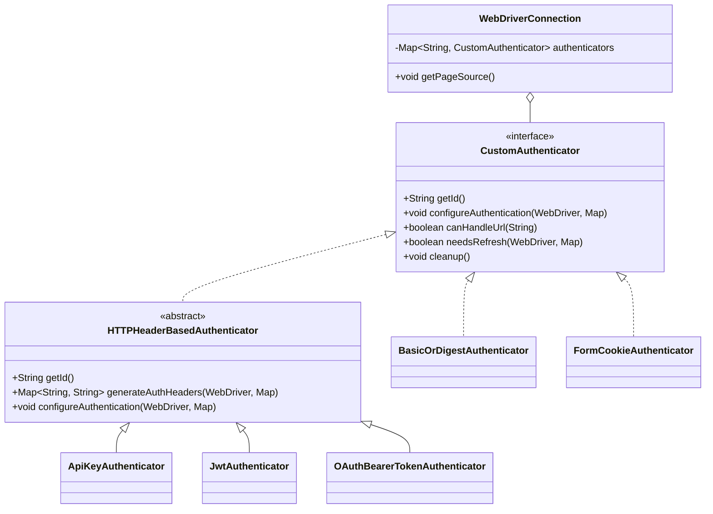
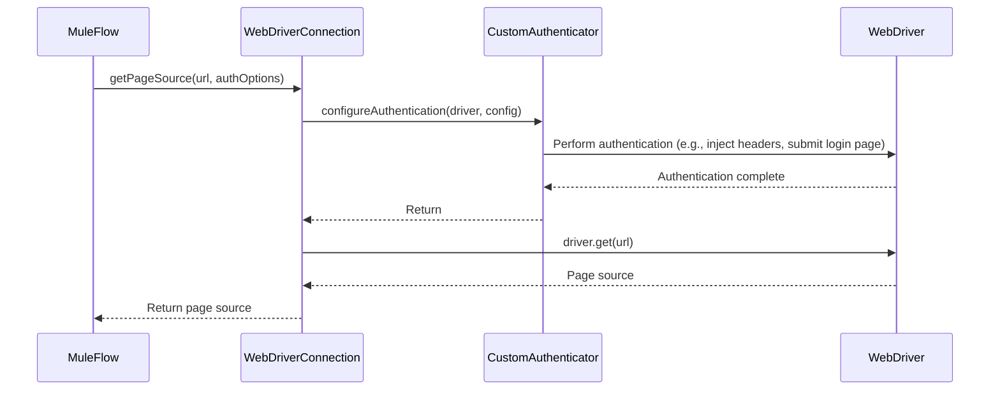

# WebCrawler Connector Authentication Framework

This document provides an overview of the authentication framework in the MuleSoft WebCrawler connector. The framework is designed to be extensible, allowing developers to add new authentication methods to handle various web security models.

## High-Level Overview

The authentication framework is built around a pluggable architecture that uses the Java Service Provider Interface (SPI) to discover and load custom authenticator implementations. This allows the connector to support a wide range of authentication schemes, from simple API keys to complex, multi-step login flows.

The core of the framework is the `CustomAuthenticator` interface, which defines the contract for all authenticators. The framework also provides a convenient abstract class, `HTTPHeaderBasedAuthenticator`, for authentication methods that rely on sending HTTP headers.

## Extending the Framework: Adding New Authenticators

To add a new authenticator, you need to follow these steps:

1.  **Implement the `CustomAuthenticator` interface:** Create a new Java class that implements the `org.mule.extension.webcrawler.api.CustomAuthenticator` interface. For header-based authentication, you can extend the `org.mule.extension.webcrawler.api.HTTPHeaderBasedAuthenticator` class.

2.  **Implement the required methods:**
    *   `getId()`: Return a unique string identifier for your authenticator (e.g., "my-custom-auth").
    *   `configureAuthentication()`: Implement the logic to perform the authentication. This method receives a Selenium `WebDriver` instance and a map of configuration properties.
    *   For `HTTPHeaderBasedAuthenticator`, you'll need to implement `generateAuthHeaders()` to return the required HTTP headers.

3.  **Register your authenticator as a service provider:** Create a file named `org.mule.extension.webcrawler.api.CustomAuthenticator` in the `src/main/resources/META-INF/services` directory of your project. In this file, add the fully qualified class name of your new authenticator class.

    For example:
    ```
    com.mycompany.connector.auth.MyCustomAuthenticator
    ```

## Key Classes and Interfaces

### `CustomAuthenticator` Interface

This is the main interface for all authenticators. It defines the following methods:

-   `String getId()`: Returns a unique ID for the authenticator.
-   `void configureAuthentication(WebDriver driver, Map<String, String> config)`: Performs the authentication logic.
-   `default boolean canHandleUrl(String url)`: (Optional) Checks if the authenticator is applicable for a given URL.
-   `default boolean needsRefresh(WebDriver driver, Map<String, String> config)`: (Optional) Checks if the authentication needs to be refreshed.
-   `default void cleanup()`: (Optional) Performs any cleanup logic.

### `HTTPHeaderBasedAuthenticator` Abstract Class

This class extends `CustomAuthenticator` and provides a base for authenticators that work by injecting HTTP headers. It handles the technical details of adding headers to requests using the Chrome DevTools Protocol or JavaScript injection.

When extending this class, you need to implement:

-   `String getId()`: The unique ID for the authenticator.
-   `Map<String, String> generateAuthHeaders(WebDriver webDriver, Map<String, String> config)`: This method should return a map of the HTTP headers required for authentication.

## Built-in Authenticators

The WebCrawler connector includes the following built-in authenticators that can be used as a reference for building custom ones:

-   `BasicOrDigestAuthenticator`: Handles basic and digest authentication.
-   `FormCookieAuthenticator`: Manages form-based logins and cookie authentication.
-   `ApiKeyAuthenticator`: Supports API key-based authentication.
-   `JwtAuthenticator`: Implements JWT (JSON Web Token) authentication.
-   `OAuthBearerTokenAuthenticator`: Handles OAuth 2.0 bearer token authentication.

Please note that MFA authentication flows are not supported.

## Example Flow: Invoking Authentication

Authentication is invoked within the connector's operations, such as `getPageSource`. The `PageLoadOptions` for these operations include an `authenticationMethodId` and an `authenticationConfiguration` map.

Here's a simplified sequence of events:

1.  A Mule flow calls a WebCrawler connector operation with authentication options.
2.  The connector's `WebDriverConnection` retrieves the `CustomAuthenticator` that matches the `authenticationMethodId`.
3.  It calls the authenticator's `configureAuthentication` method, passing the `WebDriver` instance and the configuration map.
4.  The authenticator performs the authentication (e.g., injects headers, fills out a login form and hits the submit button).
5.  The connector proceeds with the operation (e.g., fetching the page source).

## Visualizing the Architecture

### Class Diagram



### Sequence Diagram


